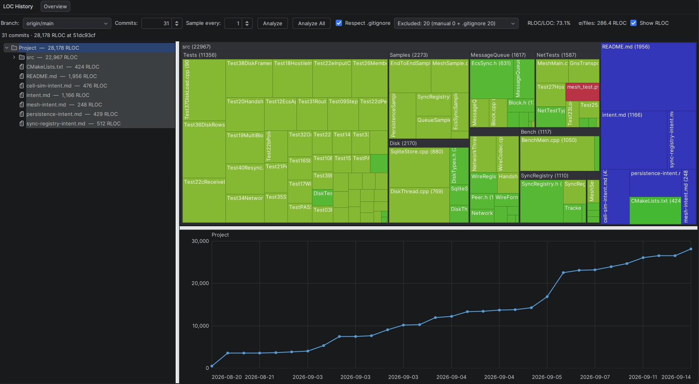
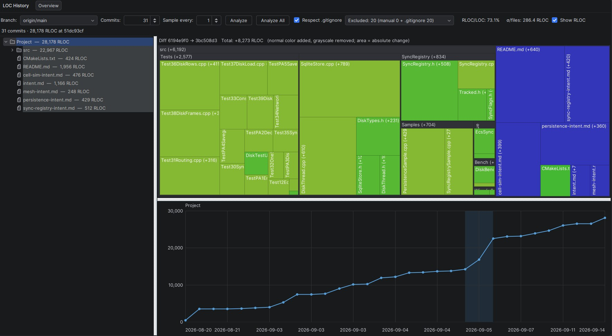

# LOC History Visualizer for CLion

Track LOC, RLOC, OpenAI tokens, and Claude tokens across Git commits and branches with a file/folder treemap, history graph, range diffs, exclusions, and a headless CI reporter.

## Run it

Install the plugin ZIP through **CLion → Settings → Plugins → ⚙ → Install Plugin from Disk**, restart CLion, open a Git project, then choose **View → Tool Windows → LOC History** and click **Analyze All**.

To run a development CLion instance instead (requires JDK 21 and Git):

```bash
./gradlew runIde
```

| Full repository view | Commit-range diff |
|---|---|
|  |  |

## What it does

- Analyzes local and remote branch history without checking out or changing the working tree.
- **Analyze** samples a configurable number of first-parent commits; **Analyze All** walks back to the initial commit and fills in the discovered commit count.
- Offers a counting dropdown for physical **LOC**, **RLOC** (nonblank, non-comment lines), **OpenAI tokens**, and **Claude 4.8+ tokens** (tokenizer details in the tooltip). Switching updates all views and statistics without rerunning analysis.
- Shows aggregate counts in a folder tree, file-type-colored squarified treemap, and interactive history graph.
- Displays commit count and selected metric total, followed by the RLOC/LOC percentage, OpenAI and Claude token totals, and OpenAI/Claude percentage on the second header line.
- Uses rounded Y-axis scales, grid lines, responsive tooltips, date ticks, and a commit-snapping hover guide.
- Drag between commits in the graph to show an absolute-change treemap. Additions retain their file-type color; removals use its desaturated form. Tooltips show signed changes and resulting totals.
- Right-click a file to exclude its complete file type from every snapshot and statistic.
- Right-click a folder to exclude it from counts and graphs while retaining one collapsed `[excluded]` footprint in the treemap; right-click it again to include it.
- Lists manual exclusions and `.gitignore` rules in the toolbar dropdown. Selecting a manual entry removes that exclusion.
- Respects root and nested `.gitignore` rules by default. Toggling this setting reruns the previous analysis mode so every view stays consistent.
- Always omits dot-directories such as `.git`, `.github`, `.idea`, and `.cache`.
- Performs analysis in a cancellable background task.

## Build

Build the installable CLion plugin:

```bash
./gradlew buildPlugin
```

The ZIP is created under `build/distributions/`.

Download a permanent, installable plugin ZIP from the repository's **Releases** page. Maintainers publish one by pushing a version tag, for example:

```bash
git tag v0.9.0
git push origin v0.9.0
```

For development builds, open the repository's **Actions** tab, select a successful **Build CLion plugin** run, and download the `loc-history-visualizer-plugin` artifact. Its archive contains the installable plugin ZIP.

## Run headless

The standalone command-line analyzer uses the same Git-based counting engine without starting CLion. It reads files directly from commits and does not check them out or modify the working tree. Build and run it with JDK 21 and Git:

```bash
./gradlew cliJar
java -jar build/libs/loc-history-visualizer-0.9.0-cli.jar \
  --repo . --branch HEAD --commits 100
```

By default it writes tab-separated records to standard output for the project, every directory, and every file at every analyzed commit. This is suitable for scripts, spreadsheets, databases, and monitoring tools. For example, running it on this repository at `v0.8.3` produces:

```text
branch	commit	timestamp	path	kind	rloc	loc	rloc_percent
HEAD	352f375ac51779b9bbc214f3ab5ad42e06f54503	2026-09-14T18:15:48Z	.	folder	1904	2147	88.68
HEAD	352f375ac51779b9bbc214f3ab5ad42e06f54503	2026-09-14T18:15:48Z	src	folder	1759	1946	90.39
HEAD	352f375ac51779b9bbc214f3ab5ad42e06f54503	2026-09-14T18:15:48Z	src/main/java/dev/lochistory/cli/LocHistoryCli.java	file	220	240	91.67
```

The final TSV row has `kind=summary` and contains project totals for the latest analyzed commit: RLOC, LOC, RLOC percentage, OpenAI tokens, and Claude tokens. It repeats that commit's `.` folder totals; it does not sum directory rows or historical snapshots.

For readable console output with aligned tables, use `--format text`. It includes the same history, folder totals, and metric summary as Markdown, and supports `--compare`:

```bash
java -jar build/libs/loc-history-visualizer-0.9.0-cli.jar \
  --repo . --branch HEAD --commits 1 --format text --quiet
java -jar build/libs/loc-history-visualizer-0.9.0-cli.jar \
  --repo . --branch HEAD --commits 1 --compare HEAD~1 --format text --quiet
```

Generate a readable Markdown dashboard and compare the latest snapshot with a base ref:

Markdown ends with a summary of LOC, RLOC, OpenAI tokens, and Claude tokens. With `--compare`, the summary also includes the base counts and deltas (latest minus base) for each metric.

```bash
java -jar build/libs/loc-history-visualizer-0.9.0-cli.jar \
  --repo . --branch HEAD --compare origin/main \
  --format markdown --output LOC_HISTORY.md
```

Its output looks like this:

```markdown
# Lines of code history

## Current total

**2,147 LOC** at `352f375a` (delta from `3bf0893c`: **+7**)

## History

| Commit | Date | LOC | Change |
|---|---:|---:|---:|
| `b27881b1` | 2026-09-14 | 23 | — |
| `59c96c51` | 2026-09-14 | 2,136 | +2,113 |
| `3bf0893c` | 2026-09-14 | 2,140 | +4 |
| `352f375a` | 2026-09-14 | 2,147 | +7 |

## Latest folders

| Folder | LOC | Share | Delta |
|---|---:|---:|---:|
| `src` | 1,946 | 90.6% | 0 |
| `gradle` | 7 | 0.3% | 0 |
```

Useful options:

- `--list-branches` lists available local and remote refs.
- `--sample-every N` analyzes every Nth commit to cover a longer history with fewer snapshots.
- `--quiet` suppresses progress messages on standard error.
- `--output FILE` writes the report to a file instead of standard output.
- `--check FILE` compares freshly generated output with a tracked report. It exits with status `3` when that report is stale, making it useful as a CI check.

Other exit codes are `0` for success, `1` for Git or filesystem errors, and `2` for invalid arguments.

## CI integration

The included [GitHub Actions workflow](.github/workflows/loc-history.yml):

- Builds the headless analyzer.
- Adds LOC deltas to pull-request job summaries.
- Refreshes and commits `LOC_HISTORY.md` after pushes to `main` when the report changed.

The workflow checks out full history (`fetch-depth: 0`) so comparisons and complete reports are available.

The separate [plugin build workflow](.github/workflows/build-plugin.yml) runs tests and plugin configuration checks, builds the installable ZIP, and uploads it as a 90-day GitHub Actions artifact on pushes, pull requests, and manual runs. Pushing a `v*` tag additionally creates a GitHub Release with the installable ZIP as a permanent release asset.

## Counting and exclusions

LOC counts every physical line in Git-tracked text files. RLOC removes blank and comment-only lines for common C/C++, JVM, JavaScript/TypeScript, scripting, SQL, and XML-style languages. Binary files are ignored.

OpenAI tokens are counted locally with [jtokkit](https://github.com/knuddelsgmbh/jtokkit), using the `o200k_base` encoding on each complete UTF-8 file, including comments, whitespace, and original line endings. Folder/project counts sum individual file token counts; filenames and chat request overhead are excluded. These counts apply to models using that encoding, and are not Anthropic counts. Unchanged Git blobs reuse their token counts across the analysis.

Claude tokens are counted offline with [ctok-java](https://github.com/clemensrunge/ctok-java), pinned at `6f9e38a4e4e02af4af66edfb3650f7294ddb8f82` under `vendor/ctok-java`. The single **Claude 4.8+ tokens** option uses `Ctok.forVersion("4.8").contentTokenCount(text)`, covering the pinned reconstruction’s shared family for Opus 4.8, Sonnet 5, and Fable 5, with fixed single-message overhead removed. This is an independent reconstruction, not an official Anthropic tokenizer. Each file is counted separately; family-specific leading boundaries and trailing-newline handling are preserved. Both providers use the same included file contents and exclusions. The pinned ctok reconstruction does not model Opus 5’s free trailing ASCII whitespace. The OpenAI/Claude statistic is OpenAI content tokens divided by Claude 4.8+ content tokens, multiplied by 100.

Counting metrics are stored by metric identity, and provider implementations share the `TokenCounter` interface. Both token metrics work in the tree, treemap, history graph, range diffs, and totals without rerunning analysis when switching the dropdown.

Analysis reads immutable commits through the Git CLI; it never modifies the checkout. In addition to dot-directories, common generated/vendor directories such as `build`, `out`, `target`, `node_modules`, `vendor`, `dist`, `.gradle`, and `cmake-build-*` are excluded by default.

The implementation does not depend on CLion C/C++ PSI APIs, so it can count every text language and works with both Nova and Classic language engines.

## License

LOC History Visualizer is licensed under the [MIT License](LICENSE), copyright © 2026 Clemens Runge.

This project bundles [jtokkit 1.1.0](https://github.com/knuddelsgmbh/jtokkit/tree/1.1.0), licensed under the [MIT License](licenses/jtokkit-LICENSE.txt), copyright © 2023 Knuddels, Philip Müller. The full project and jtokkit license notices are included under `META-INF/licenses/` in both the plugin JAR and standalone CLI JAR.

The project also bundles [ctok-java 1.3.0-java.1](https://github.com/clemensrunge/ctok-java), a Java port of Sander Land’s ctok. Its [MIT license](vendor/ctok-java/LICENSE) retains copyright © 2026 Sander Land and © 2026 Clemens Runge. Its [attribution notice](vendor/ctok-java/NOTICE) and [provenance metadata](vendor/ctok-java/PROVENANCE.json) are bundled under `META-INF/licenses/ctok/` in the dependency JAR and standalone CLI JAR.
